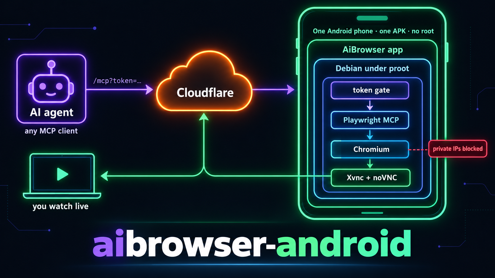
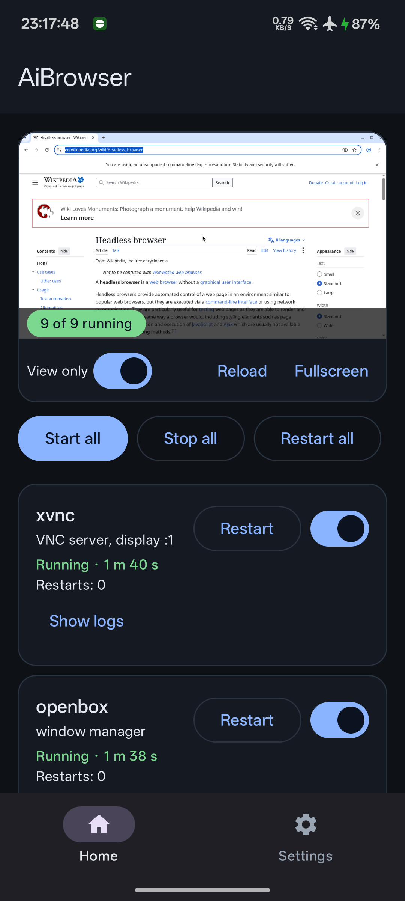
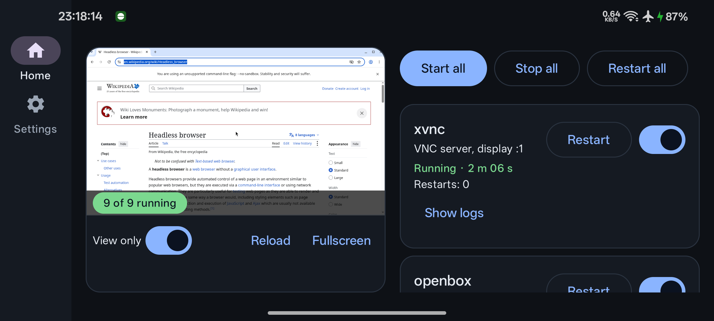
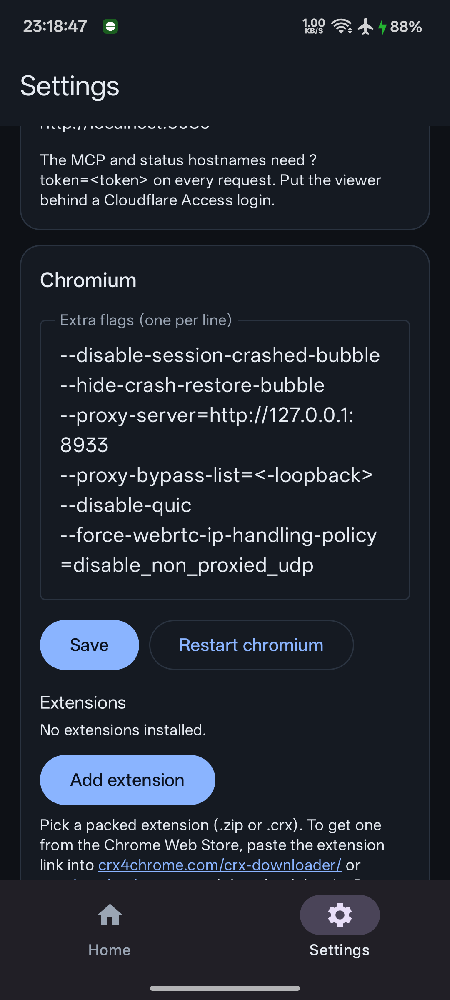

# AiBrowser for Android



Turn a spare Android phone into a headed Chromium that AI agents drive over
MCP from anywhere, with a live view of the screen for you. One APK, no root,
no Termux.

Inside the app a Debian userland runs under proot and holds Chromium, a VNC
server, noVNC, the Playwright MCP server, a token gate, a health service and a
Cloudflare tunnel. The app supervises those processes and gives you a control
panel: first-run setup, service switches and status, a live preview, tunnel
token and API tokens.

Status: in development, used daily on one phone. Requires arm64 Android 9
(API 28) or newer, about 1.5 GB free for the userland, and a Cloudflare
account for the tunnel.

## Why a phone

A phone on a residential connection with a real, headed browser passes the
bot checks that datacenter browsers fail, costs nothing to run, and survives
reboots. Measured on a Realme RMX3998: Chromium under proot loads pages as
fast as a native build.

## How it fits together

```
agent (any MCP client)
   |  https://<mcp host>/mcp?token=...
   v
Cloudflare tunnel  ->  phone: gate (8931)  ->  Playwright MCP (18931)  ->  Chromium
you                ->  phone: noVNC (6080)  ->  VNC server  ->  the same screen
```

## What it looks like

| Control panel | Landscape | Settings |
|---|---|---|
|  |  |  |

The live view is the real Chromium on the phone, over noVNC. Flip "View only"
off to click and type in it yourself.

## Install (personal use)

Sideload the APK from the [latest release](https://github.com/mrbeandev/aibrowser-android/releases),
or build one yourself (below), then open the app. **[SETUP.md](SETUP.md) walks
through the six setup steps with a screenshot of each.**

- Setup: "Prepare" runs the proot self-test; "Install" downloads the rootfs
  (about 300 MB from this repository's `rootfs` release, then a few minutes
  of extraction); then do the Android checks
  (battery optimisation exemption, disable child process restrictions).
- Settings: paste the Cloudflare tunnel token, add an API token (shown once),
  set the MCP hostname.
- Dashboard: "Start all".

The three public hostnames you create in Zero Trust map to these local ports:

| hostname | local port |
|---|---|
| MCP | 8931 |
| status | 8932 |
| viewer | 6080 |

The MCP URL for your agent is `https://<mcp host>/mcp?token=<token>`. Put the
viewer hostname behind a Cloudflare Access login so the screen stays private.

## Build from source

Requirements: JDK 17, the Android SDK (platform 36, build-tools 35), Docker
for the rootfs image. Then:

```
scripts/fetch-native.sh          # proot, busybox, tar as jniLibs
./gradlew assembleDebug          # app/build/outputs/apk/debug/app-debug.apk
scripts/make-keystore.sh         # release.jks + keystore.properties (signing)
./gradlew assembleRelease        # app/build/outputs/apk/release/app-release.apk
scripts/rootfs/build.sh          # scripts/rootfs/out/aibrowser-rootfs-<v>-arm64.tar.xz
```

### Where the userland comes from

The app downloads it from the rolling [`rootfs`](https://github.com/mrbeandev/aibrowser-android/releases/tag/rootfs)
release of this repository, which always carries the newest `manifest.json`,
tarball and `.sha256`. Because the tag never changes, publishing a new
userland there is offered as an update in Settings without an app update:

```
gh release upload rootfs manifest.json aibrowser-rootfs-<v>-arm64.tar.xz{,.sha256} --clobber
```

To host it yourself instead, put those three files in one folder on any HTTPS
host and point the app's manifest URL at `https://<host>/<folder>/manifest.json`.
The tarball is fetched from the same folder, resumed on a dropped connection,
and checked against the size and SHA-256 in the manifest before it replaces
anything.

## Licence

MIT for the app. The bundled proot, busybox and tar binaries are GPL programs
built from termux-packages, executed as separate processes; see
`THIRD_PARTY.md`. The rootfs is Debian.
