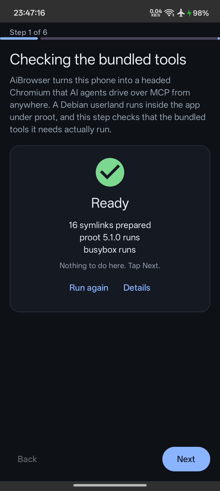
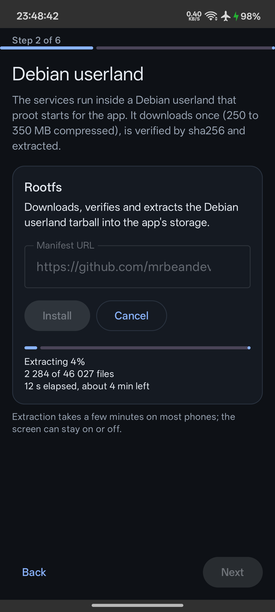
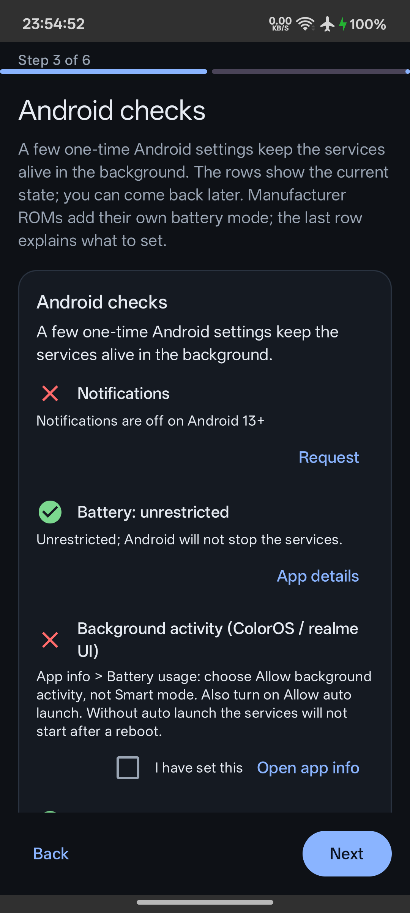
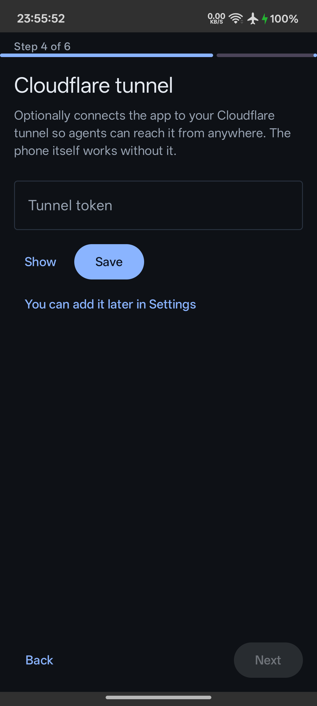
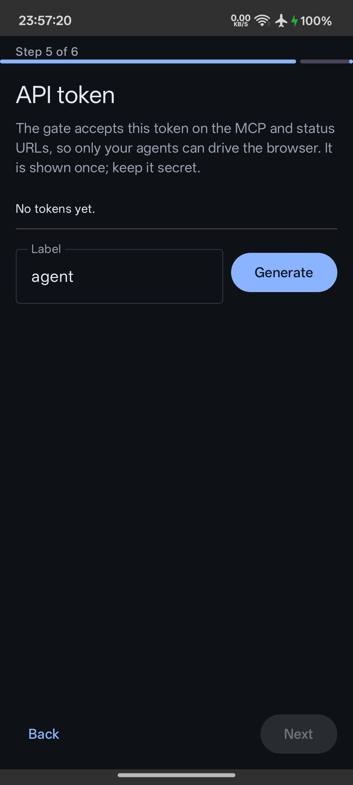
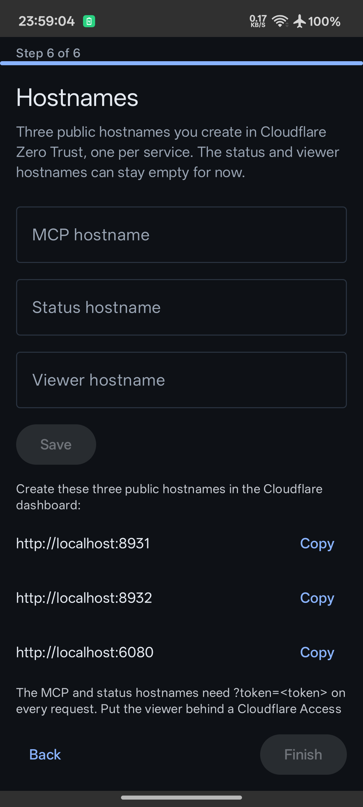
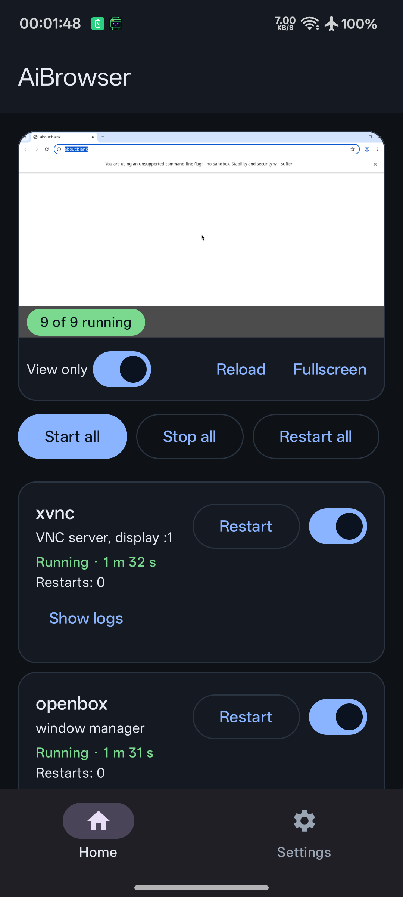

# Setup, step by step

Everything below was done on a real phone (Realme RMX3998, Android 16) from a
clean install. It takes about ten minutes, most of it waiting for the userland
to extract.

## Before you start

- An arm64 Android phone, Android 9 (API 28) or newer, with about 1.5 GB free.
  A spare phone is ideal: the browser runs whether or not you are looking at it.
- A Cloudflare account with a domain on it, if you want to reach the phone from
  anywhere. The phone works on your own network without one.
- [The APK from the latest release](https://github.com/mrbeandev/aibrowser-android/releases).

Sideload the APK and open the app. The setup runs once; afterwards the same
tools live on the Repair page.

## 1. The bundled tools



Nothing to do here. The app unpacks proot, busybox and tar out of its own APK,
links them into place and runs each one to prove it works on your phone. If
this step fails, the APK did not install cleanly; reinstall it.

## 2. The Debian userland



Press **Install**. The app downloads about 300 MB (the `rootfs` release of this
repository), checks its size and SHA-256, then extracts around 46000 files into
its own private storage.

The download resumes if your connection drops, and the extraction shows the
file count and an estimate. The screen can be off while it works. When it ends
the card reads "Installed 0.1.1".

## 3. Android settings



Android stops background work aggressively, so four things are worth setting:

| Row | What it does |
|---|---|
| Notifications | The services run in a foreground service; without the permission you cannot see its notification. |
| Battery: unrestricted | Stops Android from freezing the services. |
| Background activity (your manufacturer's own battery mode) | ColorOS, MIUI, One UI and friends add their own limits on top. **Turn on "Allow auto launch" too, or nothing starts after a reboot.** |
| Child process limit | Android 12+ kills "phantom" child processes, which is exactly what a userland is made of. The app disables that limit and keeps it disabled across reboots. |

The rows show live state; a green tick means it is already set. You can come
back to this page later from Settings → Repair and reinstall.

## 4. The Cloudflare tunnel



Optional, but it is what lets an agent reach the phone from anywhere without
opening a port on your router.

In the Cloudflare dashboard: **Zero Trust → Networks → Tunnels → Create a
tunnel → Cloudflared**, then copy the token out of the install command it shows
you. Paste it here and press Save. You can skip this and add it later in
Settings.

## 5. An API token



Press **Generate**. The app writes a 64-character token that the gate in front
of the MCP and status ports checks on every request, so only your agents can
drive the browser. It is shown once — copy it now with the copy button.

Your agent's MCP URL is then:

```
https://<your mcp hostname>/mcp?token=<the token>
```

Generate one per agent if you want to revoke them separately.

## 6. Hostnames



Back in the Cloudflare tunnel you created, add three public hostnames, each
pointing at a port on the phone:

| Hostname | Service on the phone | Protect it with |
|---|---|---|
| `mcp.example.com` | `http://localhost:8931` | the API token (`?token=`) |
| `status.example.com` | `http://localhost:8932` | the API token (`?token=`) |
| `viewer.example.com` | `http://localhost:6080` | a Cloudflare Access login |

Type the same three names here so the app can show you the exact mapping, then
press Save and Finish. The viewer has no token of its own, so put it behind
Cloudflare Access — anyone who opens it can see and drive the screen.

## 7. Running



Press **Start all**. Nine services come up in order: the X server, the window
manager, the network guard, Chromium, noVNC, the Playwright MCP server, the
token gate, the health service and the tunnel.

The panel shows a live view of the browser. "View only" off lets you click and
type in it yourself. Every service has its own switch, restart button and log.

Check it from your laptop:

```
curl "https://status.example.com/health?token=<the token>"
```

## Afterwards

- **Extensions**: Settings → Chromium → Add extension takes a packed `.zip` or
  `.crx`. Restart chromium to load it.
- **Updates**: Settings checks the `rootfs` release for a newer userland every
  time you open it; the update stops the services, installs and starts them
  again.
- **Private addresses are blocked**: Chromium's traffic goes through a local
  filtering proxy that refuses every private, loopback and link-local address,
  so an agent (or a page it visits) cannot reach your router, your NAS, or the
  phone's own services.

## When something is wrong

| Symptom | Cause |
|---|---|
| A service says "Failed — port already in use" | Another app on the phone holds that port. The app stops retrying instead of looping; free the port and press its switch. |
| Nothing runs after a reboot | The manufacturer's auto-launch permission (step 3) is off, or the phone has not been unlocked once since booting. |
| The viewer shows CONNECTION_REFUSED | noVNC is still starting; it retries on its own. |
| The update check fails | Your phone cannot reach the manifest URL shown on the Rootfs card. Any HTTPS host works; the field takes your own mirror. |
